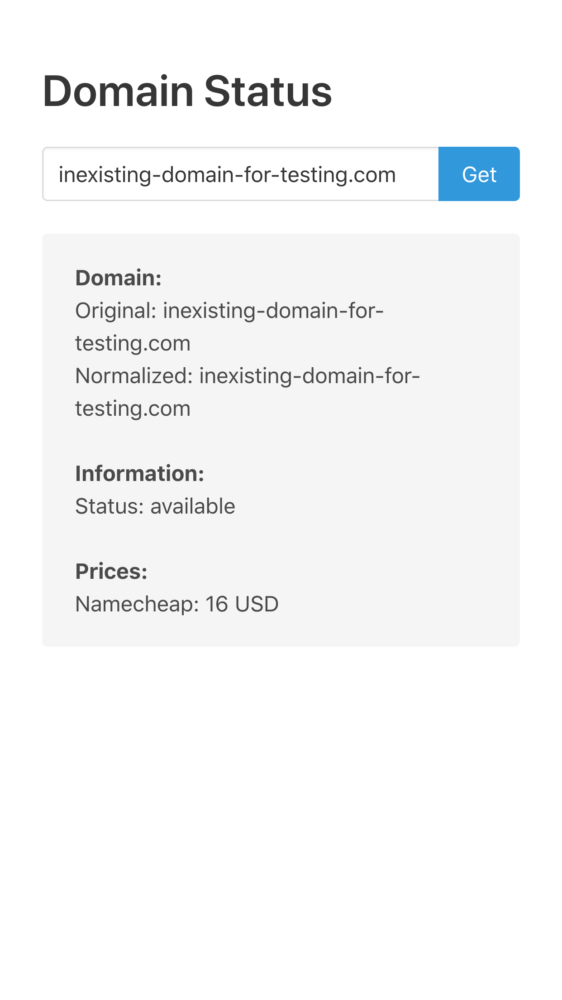
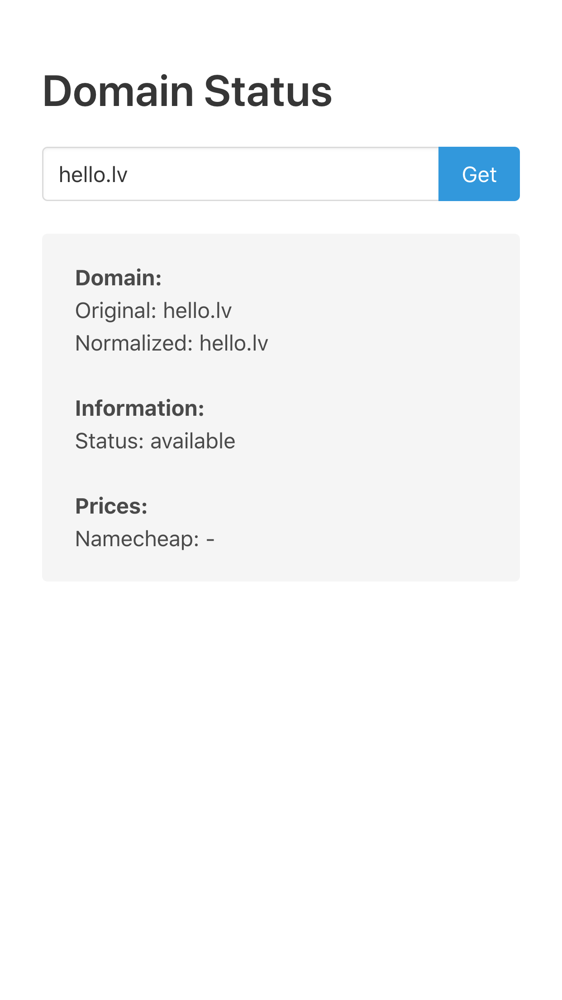
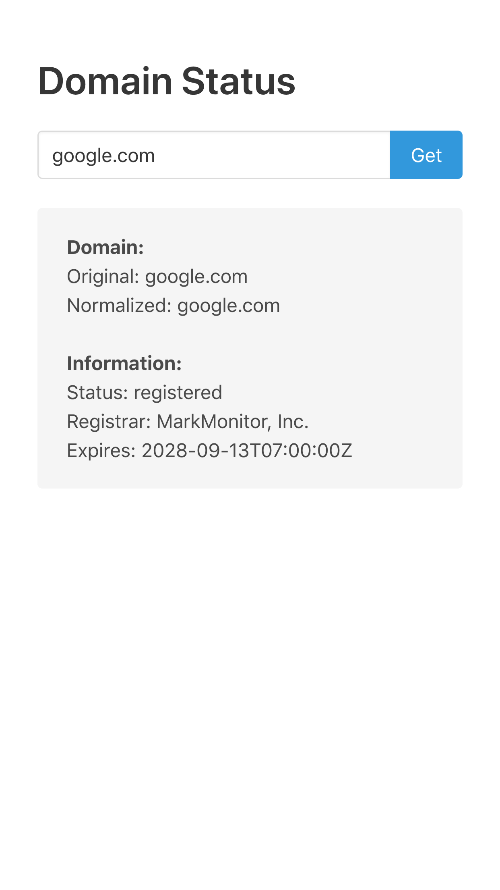
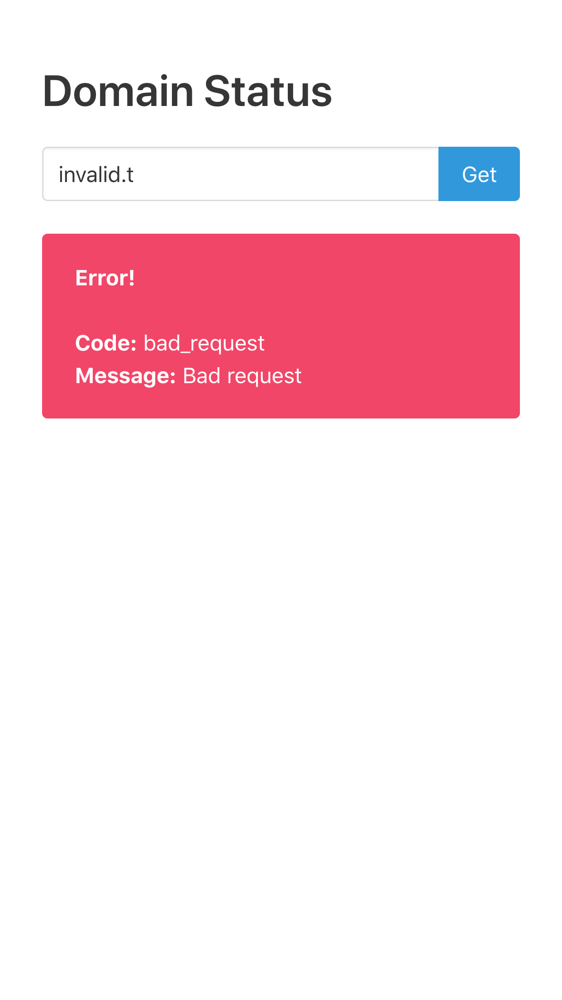

# Neotech Domain

Service to retrieve domain name information.
Task description can be found [here](./TASK.md).

Below you can find:

* [TODO](#TODO) list for all completed and outstanding tasks.
* [Design Decisions](#design-decisions) section with explanations on **why** some things
  done the way they are done.
* [Screenshots](#screenshots) to see UI

## Development

```
# Run all tests
./gradlew test
```

## Build & Run

```
export APP_INTEGRATIONS_WHOIS_WHOISXMLAPI_API_KEY=<key>
export APP_INTEGRATIONS_REGISTRAR_NAMECHEAP_API_KEY=<key>
./gradlew bootJar
java -jar libs/app.jar
open http://localhost:8080
```

## Design Decisions

### Configuration

Application defines different sets of configuration, to allow customizing
behaviour without re-builds (through any means that Spring Boot supports, like env variables)

This includes:

- Specifying Whois service to use
- Configuring each Whois service
- Specifying which Registrar services to enable
- Configuring each Registrar service

### Price for one year

I have made an assumption that we are interested only in prices for one year duration.
If that's not the case (talk to PO), then we need extend information returned by registrar to include
prices with their durations.

**Update:**

Apparently some TLD's are not providing price for 1 year (ai, nu). For those we will first available price.
I need to revisit this decision later.


### TLDs

I am using to name both top-level and second-level domain names.

### Vanilla JS website

Because frontend is not focus of this task, I decided to skip all
modern-era frontend framework shenanigans and pump out a bunch of simple JavaScript.

And I allowed myself to throw in babel standalone compiler, so I can use TypeScript.

Just mish-mash of random JS blobs, like it's 2012 all over again.

**Update:**

I regret this decision.

## TODO

This is a list of things tha I did, and list of things that I would like to do (if this would be real project).

**Plan:**

* [x] Backend
  * [x] Integrations
    * [x] Whois
      * [x] Whoisxmlapi
    * [x] Registar
      * [x] Namecheap
  * [x] Validation
    * [x] Domain
      * [x] Support non-english domains (russian, chinese, etc.)
  * [x] Domain information retrieval
    * [x] Information retrieval
  * [x] Domain price retrieval
    * [x] Support multiple providers
    * [x] Cache domain price with TTL
  * [x] Environments:
    * [x] prod
    * [x] test
  * [x] Tests
    * [x] Integration tests with real services under specific flag (to be run on CI only)
  * [x] Important
    * [x] Support multiple currencies for price
    * [x] Store price as BigDecimal (don't loose precision)
  * [x] External configuration
* [x] Frontend
  * [x] Single HTML page with vanilla JS
  * [x] Handle errors (connectivity, invalid response, validations)

**Improvements:**

* Infrastructure 
  * [ ] Docker image (consider Jib)
  * [ ] JVM configuration (heap, GC, etc.)
    * [ ] Make sure they are docker/k8s friendly (consider non-heap memory)
  * [ ] Security (CSP?, CORS?, something else?)
  * [ ] Rate limiting (is it public service?)
  * [ ] A graceful shutdown (ensure no requests lost in dynamic K8s world)
  * [ ] Create health indicators for integrations
  * [ ] Authentication (do we need one?, jwt for service-to-service?)
  * [ ] Metrics (JVM, rps, cache hits/misses, external service stability)
  * [ ] Tracing (request id, user id, other MDC)
  * [ ] Logging (tune existing, add logging for all interactions)
* Tooling
  * [ ] Code quality (formatting, linter)
  * [ ] Tidy-up gradle build file (extract plugin configurations, versions)
  * [ ] Add API documentation (e.g. Swagger)
* Architecture
  * [ ] Scaling - put some thought into type of scaling that application can support
  * [ ] Consider supporting doing domain status request in batches
      * [ ] Consider supporting async domain status retrieval for large batches
        * Accessing external services might take long time, to just wait in a single request.
          This would allow use cases like re-read statuses for all known domains.
  * [ ] Be more specific why Registrar do not provide price for domain
  * [ ] Re-visit returning prices for 1 year idea
  * [ ] Add possibility to specify what TLD's registrar supports (e.g. avoid asking Namecheap for .lv TLD)
* Backend
  * [ ] Correctly handle IPv4 and IPv6 when extracting domain name (reject them)
  * [ ] Normalize domain price to base currency (e.g. retrieving price from RU registrar in RUB and show it in EUR)
  * [ ] Consider making request to external services retryable (might incur additional costs)
  * [x] Consider limiting parsed hostname to 3 labels (to reduce cache misses)
  * [ ] Consider providing user-friendly API where you can pass any valid URL
  * [ ] Consider cascading whois information retrieval with multiple providers
  * [ ] Avoid using xml mapper holder to hide XML configuration from spring (named autowired / qualifier)
  * [ ] Drop "Service" postfix from integrations, it's annoying
  * [ ] Consider making domain status service cacheable (need to discuss business use case)
  * [ ] Apply scaling on amount according to currency
  * [ ] Add validation tests for endpoints
* Integrations
  * WhoisXMLApi
    * [x] Some domains have Whois information, but do not have registrar & expires information
      * [ ] Could it be that whois return information, but domain is actually free?
    * [ ] Cache Whois information retrieval (need to read more about how whois services work)
    * [ ] Make client response parsing more stable (consider format mismatches, different errors, etc.)
    * [ ] Custom error decoder for http client
    * [ ] More intelligent error handling required
    * [ ] Consider making whois requests cacheable (need to discuss business use case)
  * Namecheap
    * [ ] Fully translate namecheap responses to Kotlin classes
    * [ ] Custom error decoder for http client
    * [ ] Need more test coverage on various edge cases
    * [ ] Find premium domain on namecheap for testing
* Tests
  * [ ] Need to create test harness of ~100 different domains to test different use-cases (and check integrations code)
  * [ ] Start mock servers lazily (to avoid running them for tests that do not need them)
  * [x] Create mock web server for Namecheap API's
  * [ ] Add test coverage for non-ascii domain against integrations
  * [ ] Use snapshots to test large serializations (e.g. domain prices for namecheap)
  * [ ] Add body decoding in app client error decoder for integration tests (to allow testing error responses)
* UI
  * [ ] Correctly handle when service is down
  * [ ] Add loading indicator

## Screenshots





